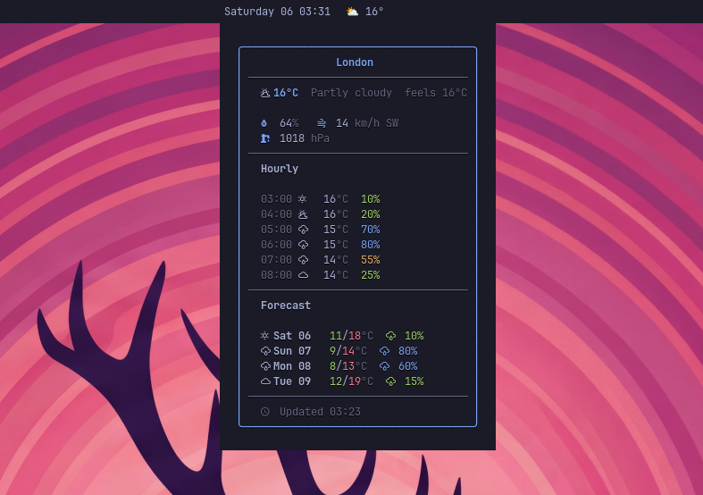
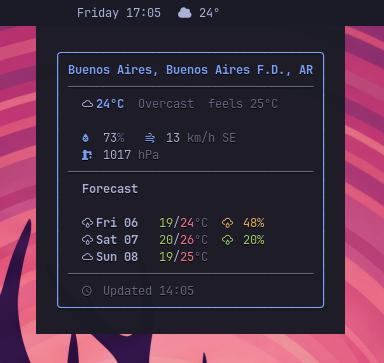
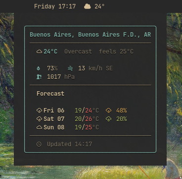
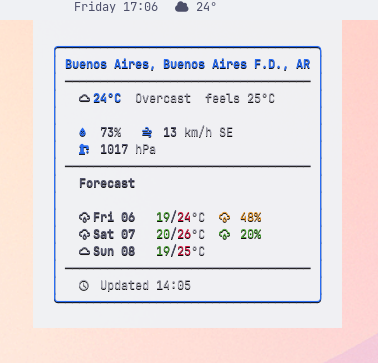

# meteobar

[](https://aur.archlinux.org/packages/meteobar)
[](LICENSE)

A weather widget for [Waybar](https://github.com/Alexays/Waybar) using [Open-Meteo](https://open-meteo.com/). No API key required.



### Why meteobar?

| Feature | wttrbar | meteobar |
|---|---|---|
| API reliability | wttr.in (frequent downtime) | Open-Meteo (stable, no limits) |
| Location disambiguation | None | Smart geocoding (City, Province, Country) |
| Day/night icons | No | Automatic (current weather) |
| Format customization | Fixed flags | Template strings with placeholders |
| CSS classes | No | Weather-condition based |
| API key required | No | No |

## Features

- Current conditions with day/night-aware icons
- Daily and hourly forecast in tooltip
- Smart geocoding with province/country disambiguation
- Auto-detect location by IP
- Multiple icon sets: Nerd Font, Weather Icons, emoji, Font Awesome
- Template-based format customization
- CSS classes per weather condition for bar styling
- Metric and imperial units
- Written in Rust — fast, single binary, no runtime dependencies

## Requirements

- [Waybar](https://github.com/Alexays/Waybar)
- A [Nerd Font](https://www.nerdfonts.com/) for icons
- (Optional) [Font Awesome](https://fontawesome.com/) ≥ 7.0.0 OTF for Font Awesome icon set

## Installation

### Arch Linux (AUR)

```bash
yay -S meteobar
```

### From source

```bash
git clone https://github.com/mryll/meteobar.git
cd meteobar
make install PREFIX=~/.local
```

Or system-wide:

```bash
sudo make install
```

To uninstall:

```bash
make uninstall PREFIX=~/.local
```

## Quick start

Add to your `~/.config/waybar/config.jsonc`:

```jsonc
"modules-right": ["custom/meteobar", ...],

"custom/meteobar": {
    "exec": "meteobar --location 'Buenos Aires'",
    "return-type": "json",
    "interval": 900,
    "tooltip": true
}
```

That's it. You'll see something like `󰖐 23°` in your bar with a full forecast tooltip on hover.

## Configuration

### CLI options

```
meteobar [OPTIONS]

Options:
  --location <NAME>            City name, "City, Province", "City, Country", or "auto" for IP geolocation.
                               Auto-detects by IP if omitted.
  --lat <FLOAT>                Latitude (requires --lon)
  --lon <FLOAT>                Longitude (requires --lat)
  --city-name <NAME>           Display name for the location (used with --lat/--lon)
  --format <TEMPLATE>          Bar text template [default: "{icon} {temp}°"]
  --tooltip-format <FORMAT>    Tooltip content: days, hours, both [default: days]
  --days <N>                   Forecast days in tooltip (1-7) [default: 3]
  --hours <N>                  Forecast hours in tooltip (0-24) [default: 0]
  --units <UNITS>              Unit system: metric, imperial [default: metric]
  --icons <SET>                Icon set for bar text: nerd, weather, emoji, fontawesome [default: nerd]
  --timeout <SECS>             HTTP timeout in seconds (1-60) [default: 10]
  --version                    Print version
  --help                       Print help
```

### Format customization

Use `--format` to control the bar text:

| Placeholder | Example | Description |
|---|---|---|
| `{icon}` | 󰖙 | Weather icon (nerd font or emoji) |
| `{temp}` | 23 | Current temperature |
| `{feels_like}` | 22 | Feels-like temperature |
| `{humidity}` | 47 | Humidity percentage |
| `{wind}` | 9 | Wind speed |
| `{wind_dir}` | NE | Wind direction (cardinal) |
| `{pressure}` | 1012 | Atmospheric pressure (hPa) |
| `{city}` | Buenos Aires | Location name |
| `{min}` | 13 | Today's minimum temperature |
| `{max}` | 26 | Today's maximum temperature |
| `{rain_chance}` | 5 | Today's precipitation probability (%) |
| `{description}` | Overcast | Weather description |

#### Examples

```bash
# Minimal (default)
meteobar --location "Berlin"
# => 󰖙 23°

# Detailed
meteobar --location "Berlin" --format "{icon} {temp}° {city} ({description})"
# => 󰖙 23° Berlin (Clear sky)

# Temperature range
meteobar --location "Berlin" --format "{icon} {min}/{max}°"
# => 󰖙 13/26°

# Weather Icons (Erik Flowers, filled with day/night variants)
meteobar --location "Berlin" --icons weather

# Emoji mode
meteobar --location "Berlin" --icons emoji
# => ☀️ 23°

# Font Awesome (requires otf-font-awesome >= 7.0.0)
# Icons are automatically wrapped in Pango markup for correct rendering
meteobar --location "Berlin" --icons fontawesome
```

> [!NOTE]
> The tooltip always uses Nerd Font icons for consistent monospace alignment, regardless of the `--icons` setting. The `--icons` flag controls the bar text only.

### CSS classes

meteobar emits CSS classes you can use in `style.css`:

| Class | Condition |
|---|---|
| `clear` | Clear sky / mainly clear |
| `cloudy` | Partly cloudy / overcast |
| `rainy` | Rain / drizzle |
| `snowy` | Snow |
| `stormy` | Thunderstorm |
| `foggy` | Fog / mist |
| `error` | Total failure |

```css
#custom-meteobar.clear { color: #e5c07b; }
#custom-meteobar.rainy { color: #81a1c1; }
#custom-meteobar.snowy { color: #88c0d0; }
#custom-meteobar.stormy { color: #bf616a; }
```

### Theming (Omarchy)

Tooltip colors are automatically read from the active [Omarchy](https://github.com/basecamp/omarchy) theme at `~/.config/omarchy/current/theme/colors.toml` on every execution. On non-Omarchy systems, the One Dark palette is used as fallback.

| Tokyo Night | Gruvbox | Catppuccin Latte |
|:---:|:---:|:---:|
|  |  |  |

### Waybar config examples

**With format and emoji:**

```jsonc
"custom/meteobar": {
    "exec": "meteobar --location 'New York' --icons emoji --format '{icon} {temp}° {description}'",
    "return-type": "json",
    "interval": 900,
    "tooltip": true
}
```

**Imperial units with hourly forecast:**

```jsonc
"custom/meteobar": {
    "exec": "meteobar --location 'London' --units imperial --tooltip-format both --hours 6",
    "return-type": "json",
    "interval": 900,
    "tooltip": true
}
```

**Auto-detect location by IP:**

```jsonc
"custom/meteobar": {
    "exec": "meteobar --location auto",
    "return-type": "json",
    "interval": 900,
    "tooltip": true
}
```

**Location with province/country disambiguation:**

```jsonc
"custom/meteobar": {
    "exec": "meteobar --location 'Avellaneda, Buenos Aires'",
    "return-type": "json",
    "interval": 900,
    "tooltip": true
}
```

### Spacing

Adjust `padding` (inside the widget) and `margin` (outside the widget) in `~/.config/waybar/style.css`:

```css
#custom-meteobar {
    padding: 0 8px;
    margin: 0 4px;
}
```

## How it works

1. Resolves location (from `--location`, `--lat/--lon`, or auto-detect by IP via [ipwho.is](https://ipwho.is/))
   - Supports `"City, Province"`, `"City, Country"`, `"City, CC"` (ISO country code) for disambiguation
   - `--location auto` explicitly uses IP geolocation
2. Fetches weather data from [Open-Meteo](https://open-meteo.com/) (free, no API key)
3. Outputs JSON that Waybar consumes (`text`, `tooltip`, `class`, `alt`)

## Troubleshooting

| Symptom | Cause | Fix |
|---|---|---|
| No output | Location not resolved | Check `--location` spelling, try `"City, Country"` format |
| Stale data | API timeout | Check internet connection; increase `--timeout` |
| Wrong location | Ambiguous city name | Use `"City, Province"` or `"City, CC"` (ISO country code) |
| `error` class | API failure | Open-Meteo may be temporarily down; widget retries on next interval |
| Nothing | Module not loaded | Check Waybar config and restart Waybar |

## Related

- [claudebar](https://github.com/mryll/claudebar) — Claude AI usage widget for Waybar
- [codexbar](https://github.com/mryll/codexbar) — OpenAI Codex usage widget for Waybar
- [logibar](https://github.com/mryll/logibar) — Logitech battery widgets for Waybar
- [Omarchy](https://github.com/basecamp/omarchy) — Beautiful, modern & opinionated Linux distribution
- [Waybar](https://github.com/Alexays/Waybar) — Status bar for Wayland compositors
